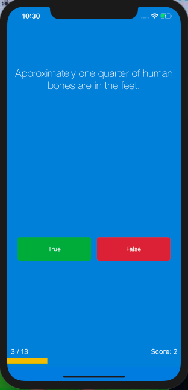

# Quiz-App

#### What is the app's purpose?
##### This is a simple quiz app with a total of 13 different questions. The app has no distinct theme and the questions have, while the same if restarted are by no means easy. 

#### Below is the main storyboard for the app. 

#### Below are several questions from the app, answers not included:

#### The meter will gradually fill up each time the user answers a question. This is good UX, so the user is aware of how long the app goes on for. 

#### At the end of the quiz an alert box will appear asking the user whether they want to restart or not 

